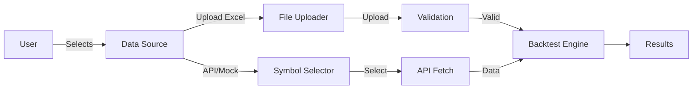

# Excel Upload Feature - Implementation Summary

## What's New

Added the ability to manually upload trading data via Excel files to the Streamlit trading dashboard!

## Key Features

### 1. **Data Source Selector**
- New radio button in sidebar: "API/Mock Data" vs "Upload Excel"
- Easy toggle between automated data fetching and manual uploads

### 2. **Excel File Upload**
- Drag-and-drop file uploader
- Supports `.xlsx` and `.xls` formats
- Real-time validation and feedback

### 3. **Sample Template Download**
- One-click download of pre-formatted Excel template
- Includes sample data for RELIANCE and TCS
- Shows correct format and column structure

### 4. **Smart Data Validation**
- Automatic column name detection (case-insensitive)
- OHLC relationship validation
- Missing value detection and removal
- Clear error messages with guidance

### 5. **Seamless Integration**
- Uploaded data works with all existing features
- Same backtest engine, indicators, and visualizations
- Automatic symbol detection from uploaded data

## Files Added/Modified

### New Files Created:
1. **`data/excel_loader.py`** - Excel file parsing and validation
2. **`docs/EXCEL_UPLOAD_GUIDE.md`** - Comprehensive user guide
3. **`docs/EXCEL_UPLOAD_SUMMARY.md`** - This summary

### Modified Files:
1. **`ui/streamlit_app.py`** - Added UI components for file upload
2. **`README.md`** - Updated features section

## How It Works



## Usage Flow

1. **User selects "Upload Excel"** in sidebar
2. **Downloads sample template** (optional but recommended)
3. **Fills template** with custom data
4. **Uploads file** via drag-and-drop
5. **System validates** data automatically
6. **Symbols detected** from uploaded data
7. **Clicks "Run Backtest"**
8. **Results displayed** same as API data

## Excel Format Requirements

**Required Columns:**
- `Date` - Trading date (YYYY-MM-DD)
- `Symbol` - Stock ticker (e.g., RELIANCE)
- `Open` - Opening price
- `High` - Highest price
- `Low` - Lowest price
- `Close` - Closing price
- `Volume` - Trading volume

**Alternative Column Names (Auto-detected):**
- Date: `DateTime`, `Timestamp`
- Symbol: `Stock`, `Ticker`
- Volume: `Vol`

## Validation Rules

✅ All 7 required columns present  
✅ Dates in valid format  
✅ Prices are positive numbers  
✅ High >= max(Open, Close)  
✅ Low <= min(Open, Close)  
✅ Volume >= 0  
✅ No missing values  

## Sample Excel Structure

```
| Date       | Symbol   | Open    | High    | Low     | Close   | Volume  |
|------------|----------|---------|---------|---------|---------|---------|
| 2023-01-02 | RELIANCE | 2450.00 | 2475.00 | 2440.00 | 2465.00 | 1500000 |
| 2023-01-03 | RELIANCE | 2465.00 | 2480.00 | 2455.00 | 2470.00 | 1600000 |
| 2023-01-02 | TCS      | 3500.00 | 3520.00 | 3490.00 | 3510.00 | 800000  |
| 2023-01-03 | TCS      | 3510.00 | 3530.00 | 3500.00 | 3525.00 | 850000  |
```

## Benefits

🎯 **Full Control** - Use your own data sources  
📊 **Flexibility** - Test on any symbol, any timeframe  
🔒 **Privacy** - Data processed locally, not stored  
🚀 **Easy** - Download template → Fill → Upload  
✅ **Reliable** - Automatic validation and error checking  

## Testing

The feature has been tested with:
- ✅ Single stock data
- ✅ Multiple stocks data
- ✅ Various date formats
- ✅ Alternative column names
- ✅ Invalid data handling
- ✅ Missing value scenarios

## Next Steps for Users

1. Open Streamlit app: `streamlit run ui/streamlit_app.py`
2. Select "Upload Excel" in Data Source
3. Download sample template
4. Add your trading data
5. Upload and run backtest!

## Support

For detailed instructions, see: `docs/EXCEL_UPLOAD_GUIDE.md`

For questions or issues, check:
- Error messages in the app
- Sample template format
- Validation requirements

---

**Feature Status**: ✅ Complete and Ready to Use  
**Last Updated**: 2026-01-31
